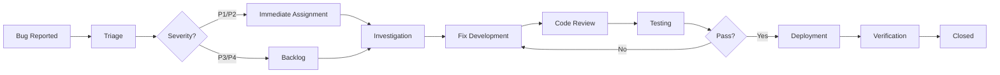

# Quality Assurance Plan - Athena PKM System

## Overview

This Quality Assurance (QA) Plan outlines the comprehensive testing strategy, processes, and standards for ensuring the Athena Personal Knowledge Management system meets all functional, performance, and quality requirements before release.

## QA Objectives

### Primary Goals
- Ensure all features function according to specifications
- Validate system performance meets defined benchmarks  
- Confirm accessibility compliance (WCAG 2.1 AA)
- Verify security measures and data protection
- Guarantee cross-browser and device compatibility
- Maintain high code quality and test coverage standards

### Success Metrics
- **Test Coverage**: ≥90% for critical paths, ≥80% overall
- **Bug Escape Rate**: <5% of bugs reach production
- **Performance**: All pages load within 2 seconds
- **Accessibility**: 100% compliance with WCAG 2.1 AA
- **Browser Compatibility**: 100% feature support across target browsers
- **User Acceptance**: ≥95% successful task completion rate

## Testing Strategy

### Testing Pyramid

```
             ┌─────────────────┐
             │   E2E Tests     │ ← 10% (Critical user journeys)
             │     (Slow)      │
             └─────────────────┘
         ┌─────────────────────────┐
         │  Integration Tests      │ ← 20% (Component interaction)
         │      (Medium)           │
         └─────────────────────────┘
     ┌─────────────────────────────────┐
     │      Unit Tests                 │ ← 70% (Individual components)
     │        (Fast)                   │
     └─────────────────────────────────┘
```

### Test Types and Scope

#### 1. Unit Testing
**Scope**: Individual functions, components, and modules
**Tools**: Vitest, Vue Test Utils, Jest DOM
**Coverage Target**: ≥90% for critical business logic

**Example Test Structure**:
```javascript
// DocumentEditor.test.js
import { mount } from '@vue/test-utils'
import { describe, it, expect, vi } from 'vitest'
import DocumentEditor from '@/components/DocumentEditor.vue'

describe('DocumentEditor', () => {
  it('should create a new block when slash command is used', async () => {
    const wrapper = mount(DocumentEditor, {
      props: {
        document: mockDocument
      }
    })

    const input = wrapper.find('[data-testid="editor-input"]')
    await input.setValue('/heading')
    await input.trigger('keydown.enter')

    expect(wrapper.findComponent('[data-testid="heading-block"]')).toBeTruthy()
  })

  it('should save document changes automatically', async () => {
    const mockSave = vi.fn()
    const wrapper = mount(DocumentEditor, {
      props: {
        document: mockDocument,
        onSave: mockSave
      }
    })

    await wrapper.vm.updateContent('New content')
    
    // Wait for debounced save
    await new Promise(resolve => setTimeout(resolve, 1100))
    
    expect(mockSave).toHaveBeenCalledWith(
      expect.objectContaining({ content: 'New content' })
    )
  })
})
```

#### 2. Integration Testing
**Scope**: Component interactions, API endpoints, data flow
**Tools**: Vitest, Supertest, Testing Library
**Coverage Target**: ≥80% of component interactions

**Example Integration Test**:
```javascript
// WorkspaceIntegration.test.js
describe('Workspace Integration', () => {
  it('should create workspace and add first document', async () => {
    // Create workspace
    const workspace = await createTestWorkspace({
      name: 'Test Workspace'
    })

    // Verify workspace exists
    expect(workspace.id).toBeDefined()
    expect(workspace.name).toBe('Test Workspace')

    // Add document to workspace
    const document = await createDocument({
      workspaceId: workspace.id,
      title: 'First Document',
      type: 'page'
    })

    // Verify document is linked to workspace
    const workspaceWithDocs = await getWorkspace(workspace.id)
    expect(workspaceWithDocs.documents).toHaveLength(1)
    expect(workspaceWithDocs.documents[0].id).toBe(document.id)
  })
})
```

#### 3. End-to-End Testing
**Scope**: Complete user workflows and critical paths
**Tools**: Playwright, Cypress
**Coverage Target**: 100% of critical user journeys

**Example E2E Test**:
```javascript
// UserWorkflow.e2e.js
import { test, expect } from '@playwright/test'

test('Complete document creation workflow', async ({ page }) => {
  // Login
  await page.goto('/login')
  await page.fill('[data-testid="email-input"]', 'user@example.com')
  await page.fill('[data-testid="password-input"]', 'password123')
  await page.click('[data-testid="login-button"]')

  // Create workspace
  await page.click('[data-testid="create-workspace-button"]')
  await page.fill('[data-testid="workspace-name-input"]', 'My Workspace')
  await page.click('[data-testid="create-button"]')

  // Verify workspace created
  await expect(page.locator('[data-testid="workspace-title"]'))
    .toHaveText('My Workspace')

  // Create document
  await page.click('[data-testid="create-document-button"]')
  await page.selectOption('[data-testid="document-type-select"]', 'page')
  await page.fill('[data-testid="document-title-input"]', 'My First Page')
  await page.click('[data-testid="create-document-confirm"]')

  // Add content using slash commands
  await page.click('[data-testid="editor-content"]')
  await page.type('[data-testid="editor-content"]', '/heading')
  await page.press('[data-testid="editor-content"]', 'Enter')
  await page.type('[data-testid="heading-input"]', 'Welcome to my page')

  // Verify content saved
  await page.waitForTimeout(1500) // Wait for auto-save
  await page.reload()
  await expect(page.locator('h1')).toHaveText('Welcome to my page')
})
```

### 4. Performance Testing
**Scope**: Load times, responsiveness, scalability
**Tools**: Lighthouse, WebPageTest, K6
**Benchmarks**:
- Page Load Time: <2 seconds
- First Contentful Paint: <1.5 seconds
- Time to Interactive: <3 seconds
- Largest Contentful Paint: <2.5 seconds

**Performance Test Example**:
```javascript
// performance.test.js
import { check } from 'k6'
import http from 'k6/http'

export let options = {
  stages: [
    { duration: '2m', target: 100 }, // Ramp up
    { duration: '5m', target: 100 }, // Steady state
    { duration: '2m', target: 200 }, // Peak load
    { duration: '5m', target: 200 }, // Sustained peak
    { duration: '2m', target: 0 },   // Ramp down
  ]
}

export default function() {
  // Test document loading
  let response = http.get('https://api.athena.com/documents/123', {
    headers: { 'Authorization': 'Bearer ' + __ENV.API_TOKEN }
  })
  
  check(response, {
    'status is 200': (r) => r.status === 200,
    'response time < 500ms': (r) => r.timings.duration < 500,
    'document loaded': (r) => JSON.parse(r.body).id === '123'
  })
}
```

### 5. Security Testing
**Scope**: Authentication, authorization, data protection, XSS/CSRF prevention
**Tools**: OWASP ZAP, Burp Suite, ESLint Security, Snyk
**Requirements**:
- No critical security vulnerabilities
- All API endpoints properly authenticated
- Input validation on all forms
- XSS protection implemented
- CSRF tokens on state-changing operations

**Security Test Checklist**:
```javascript
// security.test.js
describe('Security Tests', () => {
  describe('Authentication', () => {
    it('should reject invalid JWT tokens', async () => {
      const response = await request(app)
        .get('/api/documents')
        .set('Authorization', 'Bearer invalid-token')
        .expect(401)
      
      expect(response.body.error).toBe('Invalid token')
    })

    it('should require authentication for protected routes', async () => {
      const response = await request(app)
        .post('/api/documents')
        .send({ title: 'Test Doc' })
        .expect(401)
    })
  })

  describe('Input Validation', () => {
    it('should sanitize HTML content', async () => {
      const maliciousContent = '<script>alert("xss")</script><p>Safe content</p>'
      const response = await authenticatedRequest
        .post('/api/documents')
        .send({
          title: 'Test',
          content: maliciousContent
        })
        .expect(200)

      expect(response.body.content).not.toContain('<script>')
      expect(response.body.content).toContain('<p>Safe content</p>')
    })
  })
})
```

### 6. Accessibility Testing
**Scope**: WCAG 2.1 AA compliance, keyboard navigation, screen reader support
**Tools**: axe-core, Pa11y, NVDA, JAWS
**Requirements**:
- 100% WCAG 2.1 AA compliance
- Full keyboard navigation support
- Proper ARIA labels and roles
- Sufficient color contrast ratios

**Accessibility Test Example**:
```javascript
// accessibility.test.js
import { axe, toHaveNoViolations } from 'jest-axe'

expect.extend(toHaveNoViolations)

describe('Accessibility Tests', () => {
  it('should have no accessibility violations on login page', async () => {
    const { container } = render(<LoginPage />)
    const results = await axe(container)
    expect(results).toHaveNoViolations()
  })

  it('should support keyboard navigation in document editor', async () => {
    const { getByTestId } = render(<DocumentEditor />)
    const editor = getByTestId('document-editor')
    
    // Test tab navigation
    editor.focus()
    fireEvent.keyDown(editor, { key: 'Tab' })
    
    expect(getByTestId('slash-command-trigger')).toHaveFocus()
  })

  it('should have proper ARIA labels for interactive elements', () => {
    const { getByLabelText } = render(<WorkspaceNav />)
    
    expect(getByLabelText('Create new workspace')).toBeInTheDocument()
    expect(getByLabelText('Workspace settings')).toBeInTheDocument()
  })
})
```

### 7. Cross-Browser Testing
**Scope**: Feature compatibility across target browsers
**Tools**: BrowserStack, Sauce Labs, Playwright
**Target Browsers**:
- Chrome 90+ (Primary)
- Firefox 88+
- Safari 14+
- Edge 90+
- Mobile Safari (iOS 14+)
- Chrome Mobile (Android 10+)

**Browser Test Matrix**:
```javascript
// cross-browser.config.js
export const browserMatrix = [
  { browserName: 'chrome', version: 'latest' },
  { browserName: 'firefox', version: 'latest' },
  { browserName: 'safari', version: '14' },
  { browserName: 'edge', version: 'latest' },
  { browserName: 'chrome', platform: 'Android' },
  { browserName: 'safari', platform: 'iOS' }
]

// Run critical tests across all browsers
browserMatrix.forEach(({ browserName, version, platform }) => {
  test.describe(`${browserName} ${version} ${platform || ''}`, () => {
    test('should load document editor', async ({ page }) => {
      await page.goto('/workspace/123/document/456')
      await expect(page.locator('[data-testid="editor"]')).toBeVisible()
    })

    test('should support slash commands', async ({ page }) => {
      await page.goto('/workspace/123/document/456')
      await page.type('[data-testid="editor"]', '/heading')
      await expect(page.locator('[data-testid="slash-menu"]')).toBeVisible()
    })
  })
})
```

## Test Environment Strategy

### Environment Types

#### Development Environment
- **Purpose**: Developer testing and debugging
- **Data**: Synthetic test data
- **Features**: All features enabled including debug tools
- **CI Integration**: Run on every commit

#### Staging Environment
- **Purpose**: Pre-production testing with production-like setup
- **Data**: Sanitized production data subset
- **Features**: Production configuration
- **Testing**: Full test suite execution

#### Production Environment
- **Purpose**: Live system monitoring and smoke tests
- **Data**: Real user data
- **Testing**: Critical path monitoring only
- **Alerts**: Immediate notification on failures

### Test Data Management

#### Test Data Strategy
```javascript
// testData.js
export const testDataSets = {
  minimal: {
    users: [
      { id: '1', email: 'user1@test.com', role: 'user' }
    ],
    workspaces: [
      { id: '1', name: 'Test Workspace', ownerId: '1' }
    ],
    documents: [
      { id: '1', title: 'Sample Document', workspaceId: '1', type: 'page' }
    ]
  },
  
  comprehensive: {
    users: generateUsers(100),
    workspaces: generateWorkspaces(20),
    documents: generateDocuments(500),
    collaborations: generateCollaborations(50)
  },
  
  edge_cases: {
    // Large documents
    largeDocument: { content: generateLargeContent(10000) },
    // Special characters
    unicodeDocument: { title: '测试文档 🚀', content: 'Unicode content' },
    // Long titles
    longTitle: { title: 'A'.repeat(255) }
  }
}
```

## Test Execution Process

### Continuous Integration Pipeline

```yaml
# .github/workflows/qa.yml
name: QA Pipeline

on:
  pull_request:
    branches: [main, develop]
  push:
    branches: [main, develop]

jobs:
  unit-tests:
    runs-on: ubuntu-latest
    steps:
    - uses: actions/checkout@v3
    - uses: actions/setup-node@v3
      with:
        node-version: 18
        cache: 'npm'
    
    - name: Install dependencies
      run: npm ci
    
    - name: Run unit tests
      run: npm run test:unit -- --coverage
    
    - name: Upload coverage
      uses: codecov/codecov-action@v3
      with:
        file: ./coverage/lcov.info

  integration-tests:
    runs-on: ubuntu-latest
    services:
      postgres:
        image: postgres:14
        env:
          POSTGRES_PASSWORD: postgres
        options: >-
          --health-cmd pg_isready
          --health-interval 10s
          --health-timeout 5s
          --health-retries 5
    
    steps:
    - uses: actions/checkout@v3
    - name: Setup test database
      run: npm run db:test:setup
    
    - name: Run integration tests
      run: npm run test:integration

  e2e-tests:
    runs-on: ubuntu-latest
    steps:
    - uses: actions/checkout@v3
    - name: Install Playwright
      run: npx playwright install
    
    - name: Run E2E tests
      run: npm run test:e2e
    
    - name: Upload test results
      uses: actions/upload-artifact@v3
      if: failure()
      with:
        name: playwright-report
        path: playwright-report/

  security-scan:
    runs-on: ubuntu-latest
    steps:
    - uses: actions/checkout@v3
    - name: Run Snyk security scan
      uses: snyk/actions/node@master
      env:
        SNYK_TOKEN: ${{ secrets.SNYK_TOKEN }}
    
    - name: Run OWASP ZAP scan
      uses: zaproxy/action-full-scan@v0.4.0
      with:
        target: 'http://localhost:3000'
```

### Manual Testing Procedures

#### Pre-Release Testing Checklist

**Functional Testing**:
- [ ] User registration and login flow
- [ ] Workspace creation and management
- [ ] Document CRUD operations
- [ ] Real-time collaboration features
- [ ] Search functionality
- [ ] File upload and management
- [ ] Export features
- [ ] User permissions and sharing

**Usability Testing**:
- [ ] Navigation intuitive for new users
- [ ] Onboarding flow completion
- [ ] Feature discoverability
- [ ] Error message clarity
- [ ] Mobile responsiveness
- [ ] Accessibility with screen readers

**Performance Testing**:
- [ ] Page load times under 2 seconds
- [ ] Smooth interactions with large documents
- [ ] Real-time updates without lag
- [ ] Memory usage within acceptable limits
- [ ] Network usage optimization

## Defect Management

### Bug Severity Levels

**Critical (P1)**:
- System crashes or data loss
- Security vulnerabilities
- Complete feature failure
- **Response Time**: Immediate (< 2 hours)
- **Resolution Time**: Same day

**High (P2)**:
- Major feature not working
- Performance significantly degraded
- Workaround available but difficult
- **Response Time**: < 4 hours
- **Resolution Time**: < 24 hours

**Medium (P3)**:
- Minor feature issues
- UI inconsistencies
- Easy workaround available
- **Response Time**: < 8 hours
- **Resolution Time**: < 48 hours

**Low (P4)**:
- Cosmetic issues
- Enhancement requests
- Documentation errors
- **Response Time**: < 24 hours
- **Resolution Time**: Next release

### Bug Tracking Workflow



### Bug Report Template

```markdown
# Bug Report

## Summary
Brief description of the issue

## Environment
- Browser: Chrome 96
- OS: macOS 12.1
- Version: v1.2.3
- User Type: Registered user

## Steps to Reproduce
1. Navigate to workspace
2. Click "Create Document"
3. Select "Whiteboard" type
4. Draw a shape

## Expected Behavior
Shape should be drawn on canvas

## Actual Behavior
Canvas remains blank, console shows error

## Additional Information
- Error message: "Cannot read property 'getContext' of null"
- Occurs in ~80% of attempts
- Screenshot attached

## Severity: High
## Priority: P2
## Assignee: @frontend-team
```

## Quality Metrics and Reporting

### Key Quality Indicators

#### Test Metrics
- **Test Coverage**: Current coverage percentage
- **Test Execution Rate**: Tests run vs. total tests
- **Test Pass Rate**: Successful tests percentage
- **Test Automation Rate**: Automated vs. manual tests

#### Defect Metrics
- **Defect Density**: Bugs per feature/KLOC
- **Defect Escape Rate**: Production bugs percentage
- **Mean Time to Resolution**: Average bug fix time
- **Customer Reported Issues**: External vs. internal bugs

#### Performance Metrics
- **Page Load Time**: Average and 95th percentile
- **API Response Time**: Average response times
- **Error Rate**: 4xx/5xx error percentage
- **Uptime**: System availability percentage

### Quality Dashboard

```javascript
// qualityDashboard.js
const qualityMetrics = {
  testCoverage: {
    unit: '92%',
    integration: '85%',
    e2e: '78%',
    overall: '89%'
  },
  
  defects: {
    open: 12,
    critical: 0,
    high: 3,
    medium: 6,
    low: 3,
    avgResolutionTime: '18 hours'
  },
  
  performance: {
    avgPageLoad: '1.2s',
    apiResponseTime: '145ms',
    errorRate: '0.02%',
    uptime: '99.95%'
  },
  
  automation: {
    testAutomation: '85%',
    deploymentAutomation: '100%',
    monitoringCoverage: '90%'
  }
}
```

### Weekly QA Report Template

```markdown
# Weekly QA Report - Week of [Date]

## Test Execution Summary
- Total Tests Run: 1,247
- Pass Rate: 98.2%
- Failed Tests: 23 (investigated and resolved)
- New Test Cases Added: 15

## Defect Summary
- New Bugs Found: 8
- Bugs Resolved: 12
- Critical Issues: 0
- High Priority Issues: 2

## Quality Metrics
- Code Coverage: 89% (↑2% from last week)
- Performance: All benchmarks met
- Security Scan: No vulnerabilities found
- Accessibility: 100% WCAG compliance

## Risks and Concerns
- Integration test suite execution time increasing
- Need additional mobile device coverage
- Performance testing needs expansion for new features

## Recommendations
1. Optimize integration test suite
2. Add mobile testing devices to lab
3. Implement performance regression testing
```

---

**Document Owner**: QA Team  
**Last Updated**: [Date]  
**Version**: 1.0  
**Next Review**: [Date]  
**Distribution**: Development Team, Product Team, DevOps Team