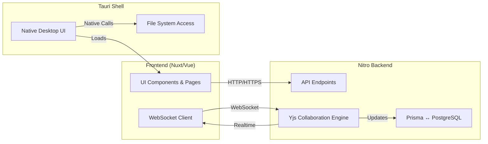

# Athena Architecture Overview

Athena is built as a modern, cross‑platform productivity platform that combines a web‑first experience with native desktop capabilities. Its architecture is organized into three distinct layers:

1. **Frontend (Nuxt 3 / Vue 3)** – Provides the user interface, routing, and client‑side state management. All UI components live in `components/` and pages in `pages/`. The frontend runs in the browser (or in a WebView when packaged) and communicates with the backend via HTTP/HTTPS and WebSocket APIs.

2. **Nitro Backend (Server‑less API)** – Powered by Nuxt 3’s Nitro engine, the backend exposes REST‑style endpoints under `server/api/`. Business logic, authentication, AI services, and real‑time collaboration are handled here. Nitro can be deployed on Vercel, Railway, or any Node‑compatible platform, and it integrates with Prisma for database access.

3. **Tauri Shell (Desktop Wrapper)** – Packages the web UI and Nitro API into a native desktop application for Windows, macOS, and Linux. Tauri supplies a secure, sandboxed environment, native file system access, and OS‑level integrations such as auto‑updates and menu handling.

Together these layers deliver a seamless experience: the web app is instantly accessible, while the Tauri shell offers offline resilience and native performance. Data flows bidirectionally through WebSockets for real‑time collaboration, persisting to IndexedDB on the client and PostgreSQL on the server.

*The diagram illustrates the high‑level flow between the three layers, highlighting how the frontend communicates with the Nitro backend and how the Tauri shell embeds the UI while providing native capabilities.*